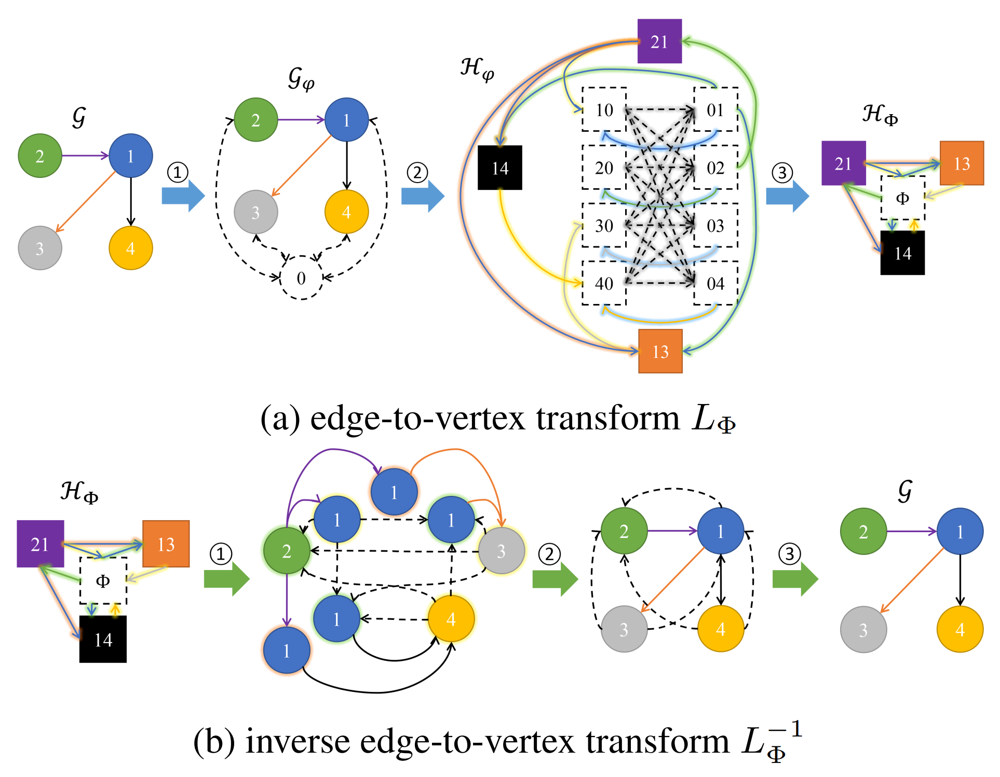

# DummyNode4GraphLearning

This repository is an official implementation of the ICML 2022 paper "Boosting Graph Structure Learning with Dummy Nodes"


## Introduction

We prove that a dummy node can help build an efficient monomorphic edge-to-vertex transform and an epimorphic inverse to recover the original graph back, which indicates that adding dummy nodes can preserve local and global structures for better graph representation learning. Implementation details are included in `graph_classification/data_processing/tu_data_processing.py` and `subgraph_isomorphism/utils/graph.py`.



We extend graph kernels and graph neural networks for graph structure learning, please refer to `graph_classification` and `subgraph_isomorphism`.

### Package Dependencies

* tqdm
* numpy
* pandas
* scipy
* eigen3
* tensorboardX
* python-igraph == 0.9.11
* torch >= 1.7.0
* numba >= 0.54.0
* dgl >= 0.6.0
* torch-geometric == 2.0.2
* torch-cluster == 1.5.9
* torch-scatter == 2.0.7
* torch-sparse == 0.6.9

### Citation

The details of this work are described in the following paper. If you use some code in your work, please consider citing it.

```bibtex
@inproceedings{DBLP:conf/icml/LiuCSJ22,
  author    = {Xin Liu and
               Jiayang Cheng and
               Yangqiu Song and
               Xin Jiang},
  title     = {Boosting Graph Structure Learning with Dummy Nodes},
  booktitle = {{ICML}},
  pages     = {13704--13716},
  year      = {2022},
}
```

### Miscellaneous

Please send any questions about code and algorithms to <xliucr@cse.ust.hk>.
